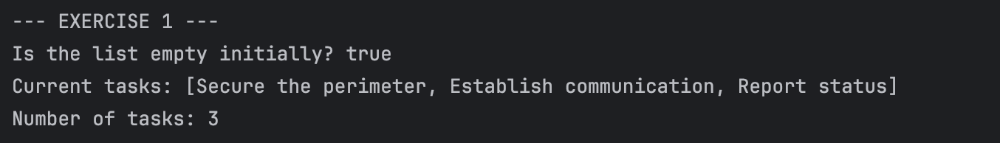
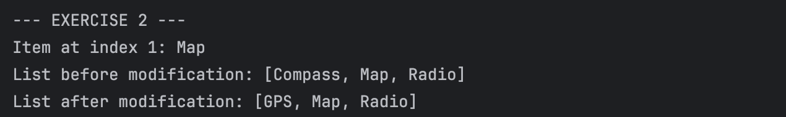
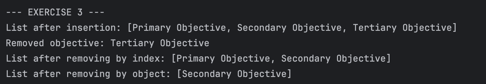
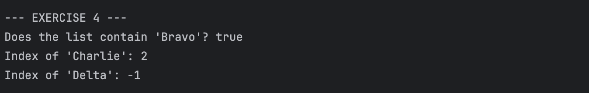
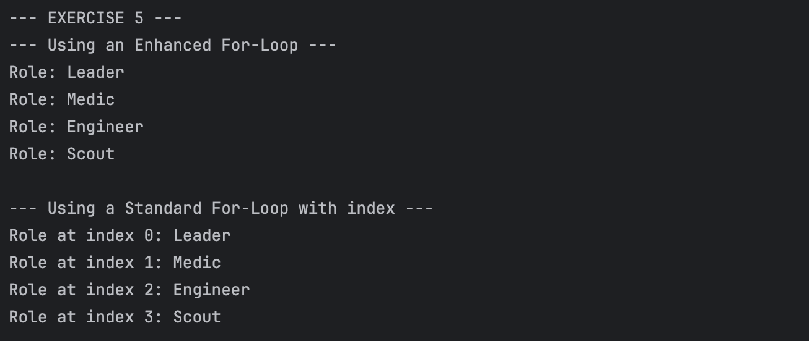
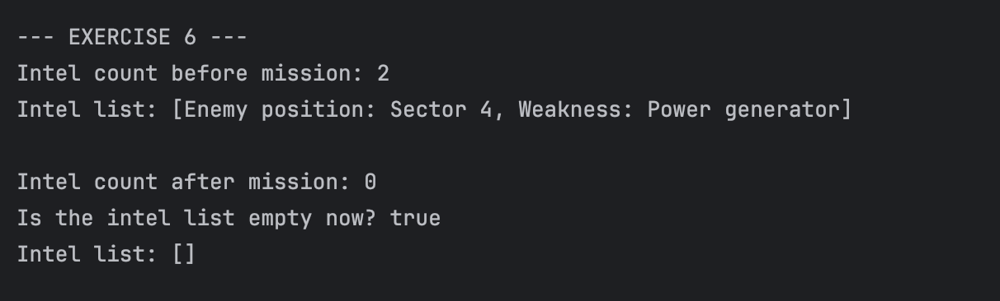

# JC-Exploring-Arraylist
**Name:** Nuan Patricia Serrano  
**Project Title:** Exploring Java ArrayList  
**Screenshot:**
- Exercise 1: Creating an ArrayList and Adding Elements (add)  
    
- Exercise 2: Accessing and Modifying Elements (get and set)  
    
- Exercise 3: Inserting and Removing Elements (add at index and remove)  
    
- Exercise 4: Searching the List (contains and indexOf)  
    
- Exercise 5: Iterating Through the List  
    
- Exercise 6: Clearing the List (clear)  
    